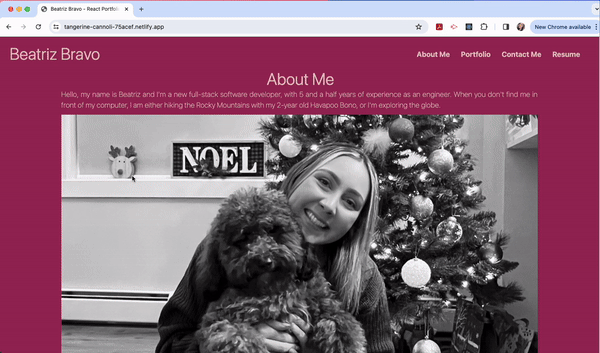

# React-Portfolio

## Description

This site was created to have a personal portfolio where colleagues and potential employers can see what I've been working on. This portfolio was created using React.js

Link to deployed site: https://beatrizbravo.ca/ 

## Table of Contents

- [Installation](#installation)
- [Usage](#usage)
- [Demo](#demo)
- [Credits](#credits)
- [License](#license)
- [How to Contribute](#how-to-contribute)

## Installation

N/A

## Usage

Navigate through the website hovering over the nav and projects. See demo below

## Demo

The following demo shows how to navigate through the site

## Credits

N/A

## License

This application is covered under [MIT](https://choosealicense.com/licenses/mit/) license

## How to Contribute

If you have any questions, comments, or concerns please feel free to reach me at beatz.bravo@gmail.com. If you would like to contribute to my project, you can find my repo on [github.com/Beabravo](https://www.github.com/Beabravo)
